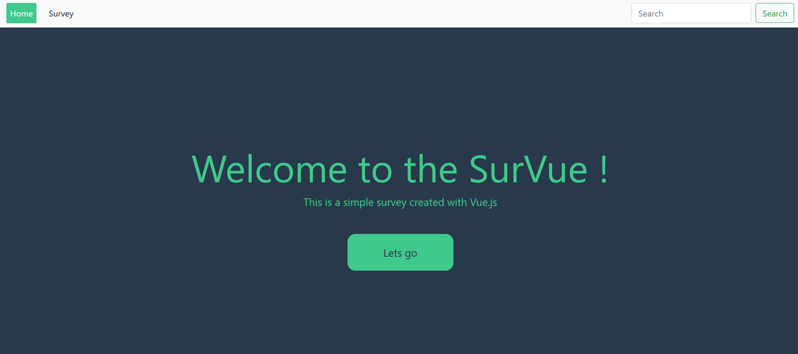
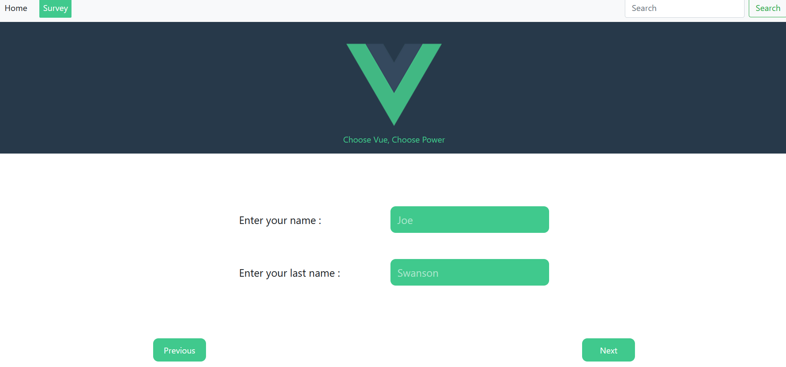
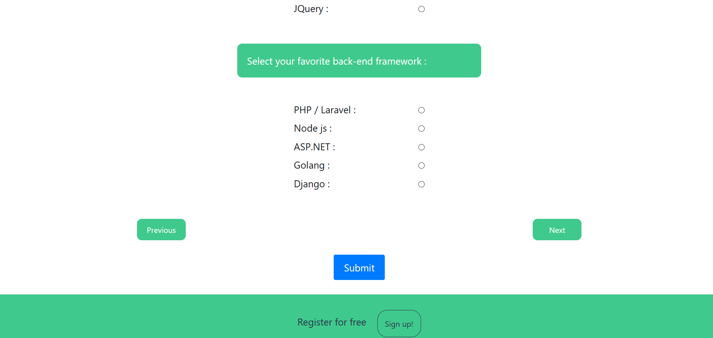

# Sur-Vue
Web application of an online survey, about programming languages. 

### What is this ?
Create a web application with Vue.js to get the user information and create a survey,  
then it sends the information as an JSON object to a URL that I defined.

### How it works ?
It collects the data by <b>vue modeling</b> and creates a JSON object , then it sends the object as 
a HTTP request via <b>vue-fetch</b> and <b>AJAX</b>. 

### Any extra features ?
It also does a validation of the user input data and will give responsive errors to user. 
Since we don't use a specific server to send the data to, you can set the URL you want and your request 
will be sent to that server. 
It also uses <b>Vuex.js</b> to make sure your data won't be lost during routing. 

#### How it looks :
 
 
 
